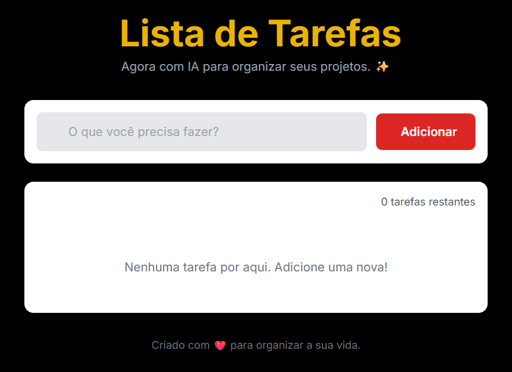

# 📋 Lista de Tarefas (To-Do List)

[](https://developer.mozilla.org/docs/Web/HTML)
[](https://tailwindcss.com/)
[](https://developer.mozilla.org/docs/Web/JavaScript)
[](LICENSE)

> Uma lista de tarefas interativa para organizar o dia a dia, com persistência local e um
> recurso de **IA (Gemini)** que divide uma tarefa grande em subtarefas.

## 🖼️ Preview



## ✨ Funcionalidades

- ✅ Adicionar, editar e remover tarefas
- ✅ Marcar tarefas como concluídas
- ✅ Contador de tarefas restantes
- ✅ **Persistência local** (as tarefas ficam salvas no navegador via `localStorage`)
- ✨ **Dividir tarefa com IA** — gera subtarefas a partir de uma tarefa principal (API Gemini)
- 🎨 Interface responsiva com tema escuro e cards claros (Tailwind CSS)

## 🛠️ Tecnologias

HTML5 · Tailwind CSS · JavaScript (Vanilla) · API Gemini (opcional, para subtarefas)

## 🚀 Como rodar

```bash
git clone https://github.com/FelipeCJ07/Lista-de-Tarefas-To-do-List-.git
```

Abra o `index.html` no navegador. Não há dependências para instalar.

> ℹ️ O recurso "Dividir tarefa com IA" requer uma chave da API Gemini configurada em `script.js`
> (o campo fica em branco no repositório). As demais funções funcionam sem nenhuma chave.

## 📁 Estrutura

```
├── index.html   # estrutura da interface
├── style.css    # estilos complementares ao Tailwind
└── script.js    # lógica das tarefas + integração com IA
```

## 📄 Licença

Distribuído sob a licença **MIT**. Veja [LICENSE](LICENSE).
